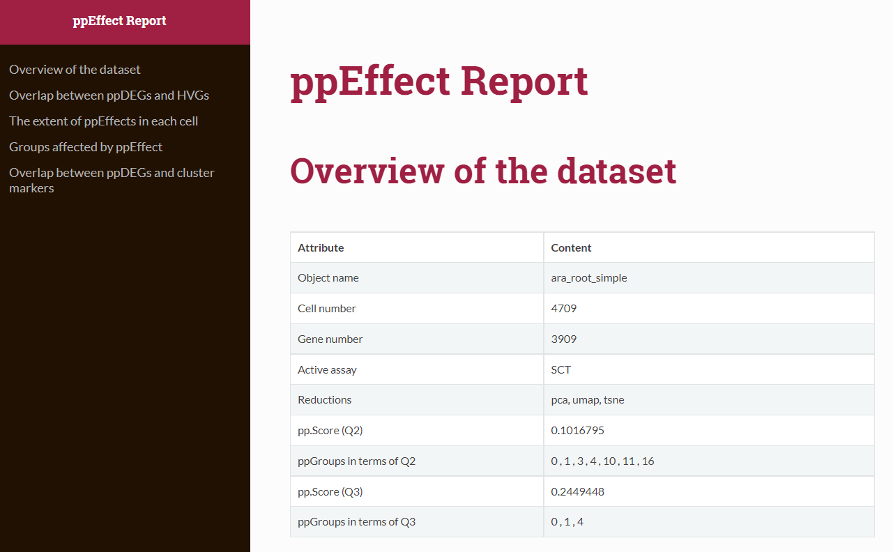
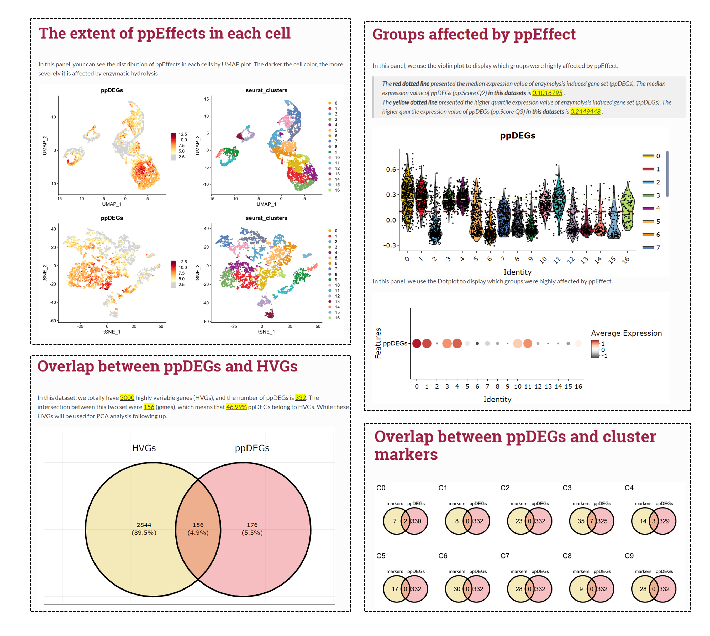

<!-- README.md is generated from README.Rmd. Please edit that file -->

```{r, include = FALSE}
knitr::opts_chunk$set(
  collapse = TRUE,
   eval = FALSE,
  comment = "#>",
  fig.path = "man/figures/README-",
  out.width = "100%"
)
```

# ppEffect

<!-- badges: start -->
<!-- badges: end -->

The goal of **ppEffect** is to systematically evaluate protoplasting effect (enzymatic effect) in scRNA-seq datasets

## Installation

You can install the development version of ppEffect from [GitHub](https://github.com/) with:

``` r
# install.packages("devtools")
devtools::install_github("YAOJ-bioin/ppEffect")
```

## Example

This is a basic example which shows you how to use this package:

### Load packages

```{r example}
library(ppEffect)

library(Seurat)
library(dplyr)
library(cowplot)
library(plotly)
library(ggvenn)
```

### Load your scRNA dataset

Prepare your scRNA dataset and load it, ***seurat object*** is compatible in our package.

```{r load scRNAdata}
## load your scRNA dataset, and create a Seurat object
data_obj <- readRDS("../data_dir/GSE123818_at_root_anno_simple.rds")

## Load 10X data from cellRanger results
# raw.data <- Read10X(data.dir = "./data/filtered_gene_bc_matrices/GSE123818_at_root_anno/")
## Initialize the Seurat object with the raw (non-normalized data).
# data_obj<- CreateSeuratObject(counts = raw.data, project = "at_root", min.cells = 3, min.features = 200)
# data_obj 
```

### Standard pre-processing workflow

The pre-processing workflow is as same as the basic pipeline on [seurat](https://satijalab.org/seurat/articles/pbmc3k_tutorial.html).

```{r pre-processing}
data_obj <- SCTransform(data_obj, verbose = FALSE)

data_obj <- RunPCA(data_obj, verbose = FALSE, approx = FALSE, npcs = 10,seed.use = NULL)
data_obj <- RunUMAP(data_obj, dims = 1:10)
data_obj <- RunTSNE(data_obj, dims = 1:10)
data_obj <- FindNeighbors(data_obj, reduction = "pca",dims = 1:10)
data_obj <- FindClusters(data_obj,resolution =0.8)

## Find marker genes is necessary, we require to submit the data.frame of marker genes in the module of evaluation.
Markers <- FindAllMarkers(data_obj)
```

Our package mainly contains three mudules: Data, Evaluation, and Method.

$\\checkmark$ **Module one Data** : A warehouse of ppDEGs from different species. We collected totally XXX gene sets, from 6 species and xxx tissues or organs. All data can be easily obtained by using ***ppDEGs_DB***.

$\\checkmark$ **Module two Evaluation** : We bulit the function ***eval_ppEffect*** to help your systematically evaluate the ppEffect in your datasets conveniently. And a ***ppEffect Report*** (.html) will be produced automatically.

$\\checkmark$ **Module three Method** : In this module, we provided several Method to help your correct the ppEffects in your datasets.

### Module one: Data

```{r data}
# Check the informations of ppDEGs_DB, and confirm which ppDEGs dataset your will choose. 
ppDEGs_DB@informations

# Select or provide a vector about ppDEGs
ppDEGs <- ppDEGs_DB$at_root_denyer_2019
```


### Module two: Evaluation

This step may cost several minutes, and a ***ppEffect Report*** will be produced. (Sorry about that, but github can’t show files that are this big right now. Please download the file to open it.)

```{r evaluate}
eval_ppEffect(object = data_obj, 
              ppDEGs = ppDEGs,
              marker_genes =Markers,
              report_dir = "./ppEffect_eval_report-example.html")
```

An example report can be obtained here: [ppEffect_eval_report-example](./man/ppEffect_eval_report-example.html)






### Module three: Method
Here we provided different methods to help your correct the ppEffect. You can choose the optimal one depends on your data specificity.
```{r method}
## return a new seurat_object after ppEffect correction. 
object_corr <- corr_ppEffect(object = object, method = "regress.out.ppDEGs")
```

