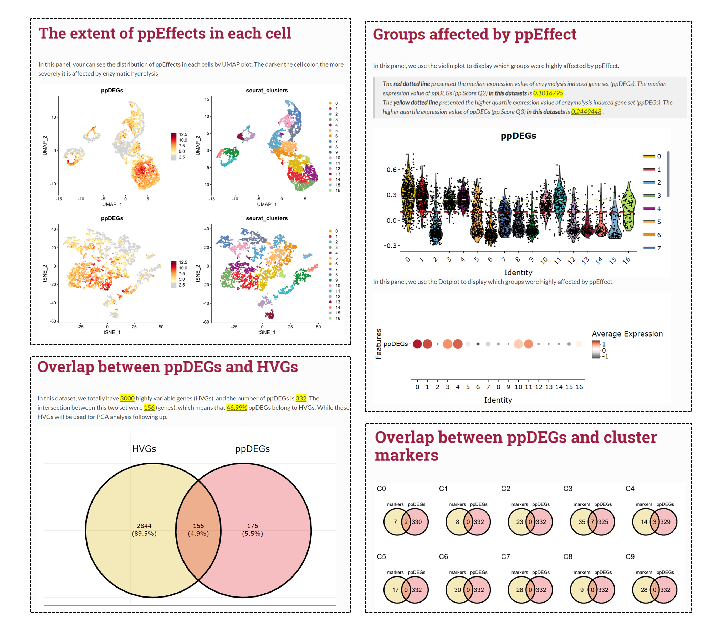

<!-- README.md is generated from README.Rmd. Please edit that file -->

# ppEffect

<!-- badges: start -->

[](https://app.codecov.io/gh/YAOJ-bioin/ppEffect?branch=master)

<!-- badges: end -->

The goal of **ppEffect** is to systematically evaluate protoplasting
effect (enzymatic effect) in scRNA-seq datasets

## Installation

You can install the development version of ppEffect from
[GitHub](https://github.com/) with:

``` r
# install.packages("devtools")
devtools::install_github("YAOJ-bioin/ppEffect")
```

## Example

This is a basic example which shows you how to use this package:

### Load packages

``` r
library(ppEffect)
library(rmarkdown)
library(markdown)
library(Seurat)
library(dplyr)
library(cowplot)
library(plotly)
library(ggvenn)
```

### Load your scRNA dataset

Prepare your scRNA dataset and load it, ***seurat object*** is
compatible in our package.

``` r
## load your scRNA dataset, and create a Seurat object
data_obj <- readRDS("../data_dir/GSE123818_at_root_anno_simple.rds")

## Load 10X data from cellRanger results
# raw.data <- Read10X(data.dir = "./data/filtered_gene_bc_matrices/GSE123818_at_root_anno/")
## Initialize the Seurat object with the raw (non-normalized data).
# data_obj<- CreateSeuratObject(counts = raw.data, project = "at_root", min.cells = 3, min.features = 200)
# data_obj
```

### Standard pre-processing workflow

The pre-processing workflow is as same as the basic pipeline on
[seurat](https://satijalab.org/seurat/articles/pbmc3k_tutorial.html).

``` r
data_obj <- SCTransform(data_obj, verbose = FALSE)

data_obj <- RunPCA(data_obj, verbose = FALSE, approx = FALSE, npcs = 10, seed.use = NULL)
data_obj <- RunUMAP(data_obj, dims = 1:10)
data_obj <- RunTSNE(data_obj, dims = 1:10)
data_obj <- FindNeighbors(data_obj, reduction = "pca", dims = 1:10)
data_obj <- FindClusters(data_obj, resolution = 0.8)

## Find marker genes is necessary, we require to submit the data.frame of marker genes in the module of evaluation.
Markers <- FindAllMarkers(data_obj)
```

Our package mainly contains three modules: Data, Evaluation, and Method.

-   **Data** : A warehouse of ppDEGs from different species. We
    collected totally 6 gene sets, from 4 species and 4 tissues or
    organs. All data can be easily obtained by using ***ppDEGs\_DB***.

-   **Evaluation** : We bulit the function ***eval\_ppEffect*** to help
    your systematically evaluate the ppEffect in your datasets
    conveniently. And a ***ppEffect Report*** (.html) will be produced
    automatically.

-   **Method** : In this module, we provided several Method to help your
    correct the ppEffects in your datasets.

### Module one: Data

The overview of ppDEGs\_DB, you can choose dataset by ID.

``` r
# Check the overview of ppDEGs_DB, and confirm which ppDEGs dataset your will choose.
Overview(ppDEGs_DB)

# *** Protoplasting induced gene sets (ppDEGs) from bulk RNA-seq analysis 
# between protoplasted cells and un-protoplasted sample.*** 
# 
# ID  |      Dataset name 
# 01  |      At_root_Denyer_2019 
# 02  |      At_leaf_Kim_2021 
# 03  |      Zm_ear_Xu_2021 
# 04  |      Zm_leaf_Bezrutczyk_2021 
# 05  |      Os_root_Liu_2021 
# 06  |      Nt_BY2_Yao_2023 
```

Here, you can use `Details` to check the specific informations for each
dataset. Input the ID number as a parameter. The basic information
includes dataset’s ID, name, species, sample type, experiment
treatment,reference, and ppDEGs. All gene set have been pre-processed,
using the threshold as `log2FC>=2` and `p_adj=0.05`

``` r
# Show details about the specific dataset, your can choose it by ID
Details(ppDEGs_DB, ID ="01")

# *************************
# 
# ID: 01 
# name: At_root_Denyer_2019 
# species: Arabidopsis thaliana 
# sample: root 
# treatment: 6-day-old; 120mins 
# ref: Denyer et al., 2019 
# ppDEGs: total 3678 genes in this dataset, E.g AT1G01060 AT1G01140 
# 
# *************************
```

ppDEGs can be extracted by the function `ppDEGsExtra`.

``` r
# select and extra  a data.frame about ppDEGs, by ID displayed .
# Or you can provide your own ppDEGs.
ppDEGs <- ppDEGsExtra(ppDEGs_DB, ID ="01")

# Extract genes directly:
ppDEGs <- ppDEGs$gene_name

## Or, you can filter the genes by the parameter: log2FoldChange or pvalue.
## For example:
ppDEGs <- ppDEGs %>% filter(log2FoldChange >=2, pvalue<0.05)
```

### Module two: Evaluation

This step may cost several minutes, and a ***ppEffect Report*** will be
produced.

``` r
data_obj <- eval_ppEffect(
  object = data_obj,
  ppDEGs = ppDEGs,
  marker_genes = Markers,
  report_dir = "/home/your absolute output path/ppEffect_eval_report-example.html"
)

# Result of pp.Score were stored here.
data_obj$ppDEGs
```

An example report can be obtained here:
[ppEffect\_eval\_report-example](./man/ppEffect_eval_report-example.html)
(Maybe github can’t show files that are this big right now. Please
download the file to open it.)




### Module three: Method

Here we provided different methods to help your correct the ppEffect.
You can choose the optimal one depending on your data specificity.

``` r
## return a new seurat_object after ppEffect correction.
### method 1 "regress.out.ppDEGs"
object_new1 <- corr_ppEffect(object = object,ppDEGs = ppDEGs, method = "regress.out.ppDEGs")
# Completed successfully!
# We have corrected ppEffect by the method "regress.out.ppDEGs".
# The dimensional reduction should be re-runned following up
```

``` r
### method 2 "remove.ppCells"
object_new2 <- corr_ppEffect(object,ppDEGs = ppDEGs, method = "remove.ppCells")

# [1] "Completed successfully!"
# We have corrected ppEffect by the method 'remove.ppCells'.
# 1177 cell has been removed
# Please re-run the pre-process pipeline following up.
```

``` r
### method 3 "remove.ppDEGs"
object_new3 <- corr_ppEffect(object,ppDEGs = ppDEGs, method = "remove.ppDEGs")

# [1] "Completed successfully!"
# We have corrected ppEffect by the method 'remove.ppDEGs'.
# Please re-run the pre-process pipeline following up.
```
